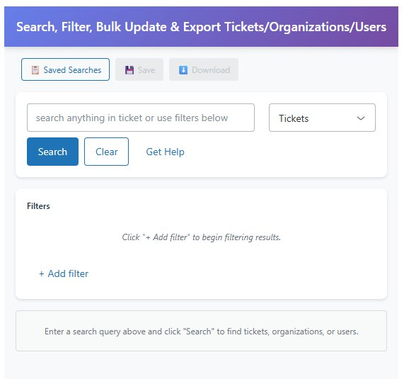
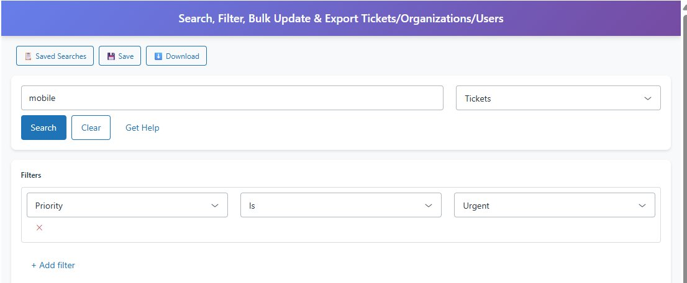
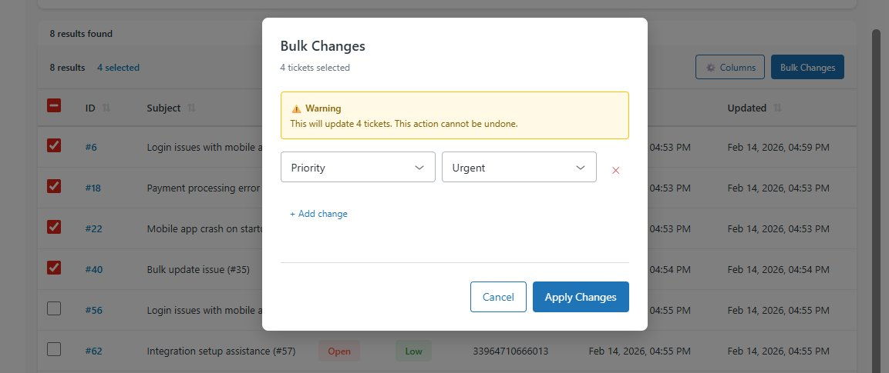
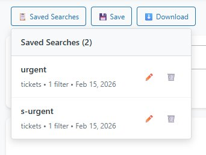
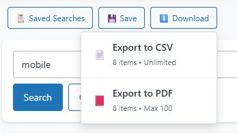

# Advanced Search & Bulk Actions for Zendesk

Welcome to the help documentation for **Advanced Search & Bulk Actions**, a powerful Zendesk app that helps you search, filter, and manage tickets, organizations, and users efficiently.

## Quick Links

- [Getting Started](./docs/getting-started.md)
- [Searching & Filtering](./docs/searching.md)
- [Bulk Actions](./docs/bulk-actions.md)
- [Saved Searches](./docs/saved-searches.md)
- [Exporting Data](./docs/exporting.md)
- [FAQ](./docs/faq.md)

## What is Advanced Search & Bulk Actions?

Advanced Search & Bulk Actions is a Zendesk sidebar app that extends Zendesk's native search capabilities with powerful features:

- **🔍 Advanced Search** - Search tickets, organizations, and users with flexible queries
- **🎯 Smart Filters** - Build complex filters with multiple conditions
- **⚡ Bulk Updates** - Update multiple records at once
- **💾 Saved Searches** - Save and reuse your favorite searches
- **📊 Export** - Export results to CSV or PDF
- **🎨 Clean Interface** - Modern, intuitive design

## Key Features

### Search Anything
Search across tickets, organizations, and users from a single interface. Use keywords or advanced filters to find exactly what you need.

### Advanced Filtering
Build sophisticated filters using any field:
- Priority, Status, Type
- Tags, Assignee, Requester
- Created date, Updated date
- Custom fields
- And more!

### Bulk Operations
Select multiple records and update them all at once:
- Change priority
- Update status
- Add/remove tags
- Assign to agent
- And more!

### Save Your Searches
Save frequently used searches for quick access. Edit or delete saved searches anytime.

### Export Results
Export your search results to:
- **CSV** - Unlimited records
- **PDF** - Up to 100 records (freemium limit)

---

**Made with ❤️ for Zendesk users**
