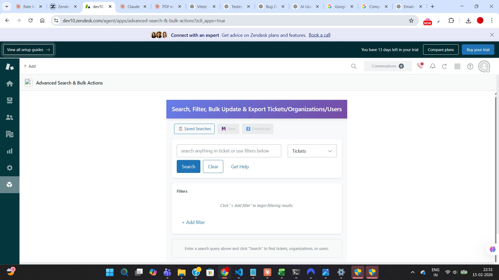
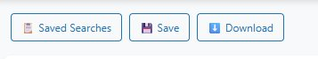

# Getting Started

This guide will help you start using Advanced Search & Bulk Actions in just a few minutes.

## Accessing the App

1. **Log in to Zendesk** - Navigate to your Zendesk Support instance
2. **Open any ticket** - The app appears in the ticket sidebar
3. **Click the Apps icon** - Look for the apps panel on the right side
4. **Find "Advanced Search & Bulk Actions"** - Click to open the app

## Understanding the Interface

The app interface has three main sections:

### 1. Action Buttons (Top)
- **Saved Searches** - Access your saved searches
- **Save** - Save the current search
- **Download** - Export search results

### 2. Search Bar (Middle)
- **Search input** - Enter keywords or queries
- **Entity selector** - Choose Tickets, Organizations, or Users
- **Search button** - Execute your search
- **Clear button** - Reset the search
- **Get Help button** - Opens this documentation

### 3. Results Table (Bottom)
- View search results in a sortable table
- Select multiple rows for bulk actions
- Click IDs to open records
- Customize columns displayed

## Your First Search

Let's perform a simple search:

### Example 1: Find Open Tickets

1. **Select entity type**: Choose "Tickets" from dropdown
2. **Enter search query**: Type `status:open`
3. **Click Search**
4. **View results**: See all open tickets in the table

### Example 2: Search by Keyword

1. **Select entity type**: Choose "Tickets"
2. **Enter search query**: Type `mobile` (or any keyword)
3. **Click Search**
4. **View results**: See tickets containing "mobile"

## Using Filters

For more precise searches, use the filter builder:

1. **Click "+ Add filter"** below the search bar
2. **Select a field** - Choose from Priority, Status, Type, etc.
3. **Select an operator** - Choose "is", "is not", "contains", etc.
4. **Enter a value** - Type or select the value
5. **Add more filters** - Click "+ Add filter" to add additional conditions
6. **Click Search** - Execute the filtered search

### Filter Examples

**Find high priority urgent tickets:**
- Filter 1: Priority → is → High
- Filter 2: Status → is → Open

**Find tickets created this week:**
- Filter 1: Created → is after → 2026-02-10

**Find unassigned tickets:**
- Filter 1: Assignee → is → (empty)

## Common Search Queries

Here are some useful search queries to try:

| Search Query | What it Finds |
|--------------|---------------|
| `status:open` | All open tickets |
| `priority:high priority:urgent` | High or urgent priority tickets |
| `type:incident` | All incident tickets |
| `tags:mobile` | Tickets tagged with "mobile" |
| `created>2026-02-01` | Tickets created after Feb 1, 2026 |
| `assignee:me` | Tickets assigned to you |

## Selecting Records

To perform bulk actions or export data:

1. **Check the checkboxes** - Click checkboxes next to records
2. **Or select all** - Click the header checkbox to select all results
3. **Take action** - Use the "Bulk Changes" or "Download" buttons

## Next Steps

Now that you know the basics, explore:

- [Searching & Filtering →](./searching.md) - Learn advanced search techniques
- [Bulk Actions →](./bulk-actions.md) - Update multiple records at once
- [Saved Searches →](./saved-searches.md) - Save and reuse searches
- [Exporting Data →](./exporting.md) - Export results to CSV or PDF

---

[← Back to Home](../README.md)
