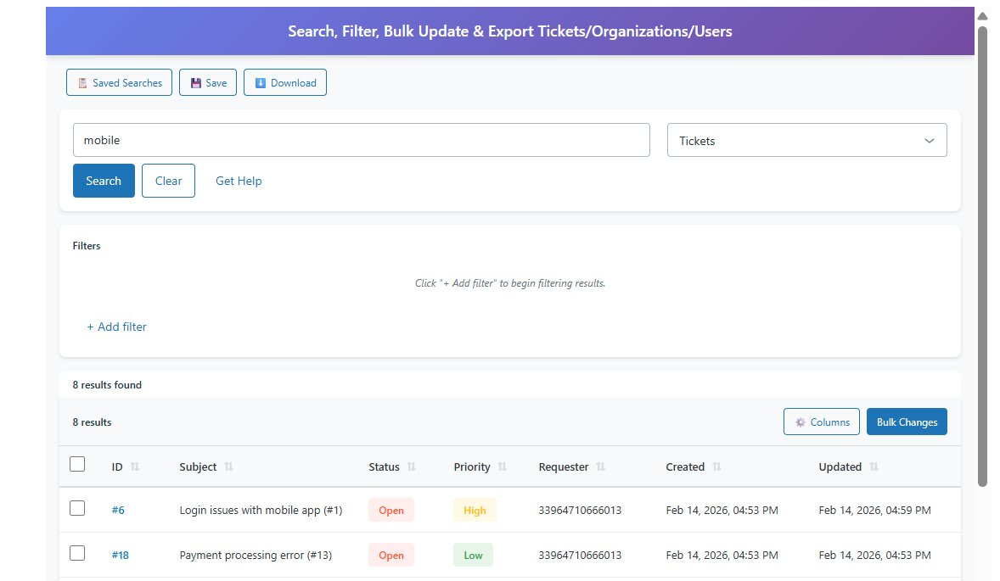

# Searching & Filtering

Learn how to search and filter tickets, organizations, and users effectively.

## Search Methods

Advanced Search & Bulk Actions offers two ways to search:

1. **Quick Search** - Type keywords directly in the search box
2. **Filter Builder** - Build complex filters using field-based criteria

## Quick Search

The fastest way to find records is using the search box.

### How to Quick Search

1. Select entity type (Tickets, Organizations, or Users)
2. Type your search query in the search box
3. Click "Search" or press Enter



### Search Query Syntax

Use Zendesk's search syntax to create powerful queries:

#### Basic Keywords
```
mobile
payment processing
login error
```

#### Field-Specific Searches
```
status:open
priority:high
type:incident
assignee:john.doe@company.com
requester:customer@email.com
tags:billing
```

#### Date Searches
```
created>2026-02-01
created:2026-02-15
updated<2026-01-01
created>2026-02-01 created<2026-02-15
```

#### Multiple Conditions
```
status:open priority:high
type:incident tags:urgent
priority:high assignee:me
```

### Search Operators

| Operator | Description | Example |
|----------|-------------|---------|
| `:` | Equals | `status:open` |
| `>` | Greater than | `created>2026-02-01` |
| `<` | Less than | `updated<2026-01-01` |
| `-` | Not/Exclude | `-status:solved` |
| `*` | Wildcard | `subject:*refund*` |

## Filter Builder

For more complex searches, use the visual filter builder.


### How to Use Filters

1. **Click "+ Add filter"** below the search bar
2. **Select a field** from the first dropdown:
   - Priority
   - Status
   - Type
   - Tags
   - Assignee
   - Requester
   - Created
   - Updated
   - And more...

3. **Select an operator** from the second dropdown:
   - Is
   - Is not
   - Contains
   - Does not contain
   - Greater than
   - Less than
   - Is empty
   - Is not empty

4. **Enter a value** in the third field
5. **Add more filters** by clicking "+ Add filter" again
6. **Remove filters** by clicking the ✕ button
7. **Click Search** to execute

### Filter Examples

#### Find Urgent Open Tickets
- **Filter 1:** Priority → is → Urgent
- **Filter 2:** Status → is → Open

#### Find Recent High Priority Incidents
- **Filter 1:** Type → is → Incident
- **Filter 2:** Priority → is → High
- **Filter 3:** Created → is after → 2026-02-10

#### Find Unassigned Tickets with Specific Tag
- **Filter 1:** Assignee → is empty
- **Filter 2:** Tags → contains → billing

#### Find Tickets Updated This Week
- **Filter 1:** Updated → is after → 2026-02-10
- **Filter 2:** Updated → is before → 2026-02-17

## Entity Types

### Searching Tickets

Available ticket fields:
- Subject, Description
- Status, Priority, Type
- Assignee, Requester, Submitter
- Group, Organization
- Tags
- Created, Updated, Due Date
- Custom fields

**Example queries:**
```
status:open priority:high
type:question tags:feature-request
assignee:me status:pending
```

### Searching Organizations

Available organization fields:
- Name
- Tags
- Created, Updated
- Custom fields

**Example queries:**
```
tags:vip
created>2026-01-01
name:*Corporation*
```

### Searching Users

Available user fields:
- Name, Email
- Role (agent, admin, end-user)
- Organization
- Tags
- Created, Updated
- Custom fields

**Example queries:**
```
role:agent
organization:Acme Corp
email:*@gmail.com
```

## Search Tips

### 1. Start Broad, Then Narrow
Begin with a simple search, then add filters to refine results.

### 2. Use Saved Searches
Save frequently used searches for quick access later.

### 3. Combine Keywords and Filters
You can use both the search box AND filters together for maximum precision.

### 4. Check Your Entity Type
Make sure you've selected the correct entity type (Tickets/Organizations/Users) before searching.

### 5. Clear Between Searches
Click "Clear" to reset filters and start fresh.

## Common Search Scenarios

### Support Agent Tasks

**Find my open tickets:**
```
assignee:me status:open status:pending
```

**Find escalated tickets:**
```
priority:urgent status:open
```

**Find tickets needing response:**
```
status:pending assignee:me
```

### Management Reporting

**Find tickets created today:**
```
created:2026-02-15
```

**Find unresolved tickets:**
```
status:new status:open status:pending
```

**Find tickets by customer:**
```
organization:"Customer Name"
```

### Quality Assurance

**Find recently solved tickets:**
```
status:solved updated>2026-02-01
```

**Find tickets with specific tag:**
```
tags:reviewed
```

## Troubleshooting Searches

### No Results Found

If you get no results:

1. **Check spelling** - Verify field names and values
2. **Remove filters** - Try a broader search
3. **Check entity type** - Make sure you're searching the right entity
4. **Verify syntax** - Ensure proper search query format

### Too Many Results

If you get too many results:

1. **Add more filters** - Narrow your criteria
2. **Use date ranges** - Limit by creation or update date
3. **Add field-specific searches** - Be more specific

### Unexpected Results

If results seem wrong:

1. **Review filters** - Check that operators are correct (is vs. is not)
2. **Clear and rebuild** - Start fresh if filters are complex
3. **Use OR vs AND** - Remember multiple values in search box use OR logic

## Next Steps

- [Bulk Actions →](./bulk-actions.md) - Learn to update multiple records
- [Saved Searches →](./saved-searches.md) - Save your searches
- [Exporting Data →](./exporting.md) - Export results

---

[← Back to Home](../README.md) | [Getting Started →](./getting-started.md)
